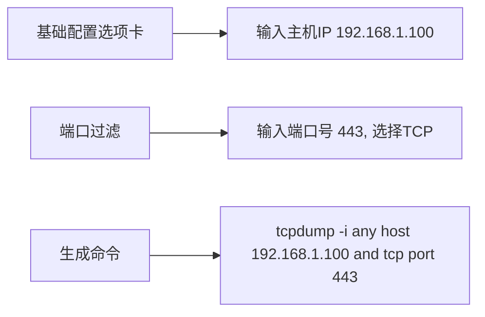
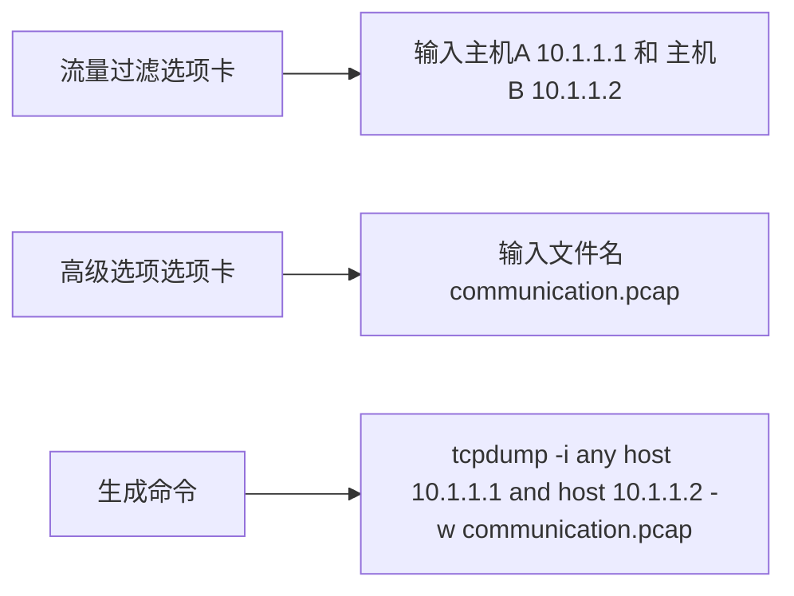
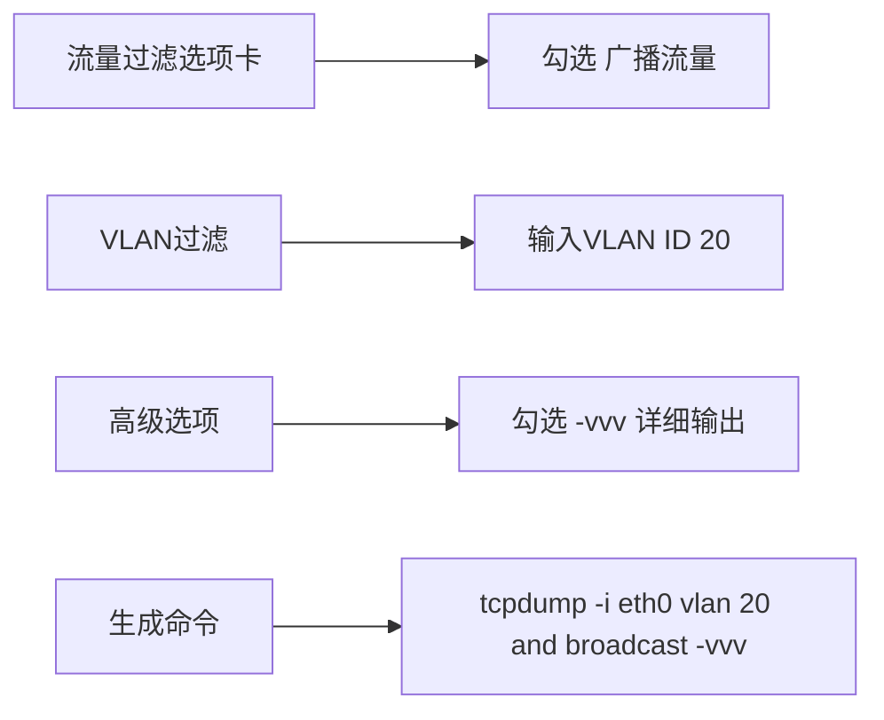
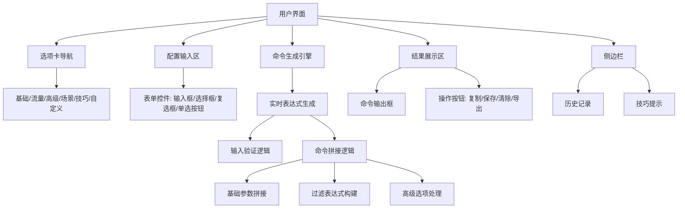

```markdown
# 🕵️‍♂️ tcpdump命令生成器

<p align="center">
  
  
  
  
</p>

> 可视化工具，帮助Linux新手和网络工程师轻松生成tcpdump命令，快速上手网络分析

**tcpdump命令生成器** 是一个强大的Web应用，通过直观的图形界面简化了复杂 `tcpdump` 命令的创建过程。它覆盖了从基础接口指定到高级协议过滤、抓包限制和文件输出等所有核心功能，并融入了丰富的实战技巧，帮助用户高效解决网络连通性、性能和安全问题。


## ✨ 核心功能

### 🛠️ 全面命令构建
- **接口指定**：选择或输入网络接口（eth0, wlan0, any等）
- **主机过滤**：支持IPv4和IPv6地址过滤（源/目的/双向）
- **端口过滤**：指定TCP/UDP端口（源/目的/双向），内置常用端口
- **协议过滤**：TCP、UDP、ICMP、ARP、LLDP等常见协议快速勾选
- **VLAN过滤**：捕获特定VLAN ID或任意VLAN流量
- **主机通信**：专门过滤两台主机之间的双向流量

### ⚙️ 高级选项配置
- **输出文件**：指定文件名，支持轮询写入（按大小和数量）
- **抓包限制**：设置抓包数量（-c）和抓包大小（-s）
- **输出控制**：-n, -nn, -e, -l, -X, -XX 等选项一键勾选
- **详细级别**：支持 -v, -vv, -vvv 详细输出
- **广播/组播**：专门过滤广播风暴或组播问题

### 🚀 效率与实战
- **一键场景**：预置TCP握手、DNS、VLAN、广播等常见分析场景
- **实时生成**：所有选项变动即时更新最终tcpdump命令
- **历史记录**：保存和重用常用命令（支持本地存储）
- **配置管理**：导入/导出配置文件（JSON格式）
- **脚本导出**：一键将命令导出为可执行的Shell脚本
- **BPF助手**：提供常用Berkeley Packet Filter表达式模板
- **实战技巧**：内置24项从基础到安全的tcpdump实战技巧

### 📱 响应式设计
- **多端适配**：完美适配桌面、平板和手机等不同设备屏幕
- **直观交互**：现代化UI设计，操作流畅，易于上手

## 🚀 快速使用

### 本地运行
```bash
将 dumpcraft.html 文件保存到本地
```

## 🖥️ 界面导览

### 基础配置选项卡

1.  **网络接口**：指定抓包接口或选择常用接口
2.  **IP地址过滤**：输入IPv4或IPv6地址，选择过滤方向（源/目的/双向）
3.  **端口过滤**：输入端口号，选择协议（TCP/UDP）和方向

### 流量过滤选项卡

1.  **协议过滤**：勾选需要捕获的协议（TCP, UDP, ICMP等）
2.  **主机间通信**：输入两台主机IP，过滤它们之间的流量
3.  **VLAN过滤**：指定VLAN ID或捕获所有VLAN流量
4.  **广播/组播**：勾选以捕获相关类型的流量

### 高级选项选项卡

1.  **输出到文件**：设置文件名、轮询大小和数量
2.  **抓包限制**：设置抓包总数和每个包的大小
3.  **输出选项**：勾选各种输出控制参数
4.  **详细程度**：选择命令的详细输出级别

### 常见场景选项卡

- **TCP三次握手**：一键生成捕获TCP连接建立过程的命令
- **DNS流量**：捕获DNS查询与响应，并显示详细信息
- **VLAN流量**：针对特定VLAN ID的流量捕获
- **广播/组播**：用于排查广播风暴或组播问题
- **ICMP Ping**：捕获ICMP Echo请求与响应
- **ARP流量**：捕获ARP请求与响应

### 实战技巧选项卡

- **基础技巧**：指定接口、限制数量、禁止DNS解析等入门技巧
- **高效过滤**：主机、端口、协议、方向、组合过滤技巧
- **高级分析**：抓包头、轮询写入、详细输出、十六进制显示
- **安全排障**：TCP SYN扫描、DNS查询、广播风暴检测技巧

### 自定义选项卡

1.  **自定义命令**：可以直接输入完整的tcpdump命令或BPF表达式
2.  **BPF助手**：点击按钮，选择常用BPF表达式模板快速应用

## 🛠️ 使用示例

### 场景1：捕获特定主机的HTTPS流量


### 场景2：分析两台主机间的通信并保存到文件


### 场景3：排查VLAN 20内的广播风暴


## 💡 tcpdump实战技巧摘要

### 基础技巧
| 技巧编号 | 技巧名称       | 命令示例                                  |
| -------- | -------------- | ----------------------------------------- |
| 1        | 指定接口抓包   | `tcpdump -i eth0`                         |
| 2        | 限制抓包数量   | `tcpdump -c 100`                          |
| 3        | 禁止DNS解析    | `tcpdump -n`                              |
| 4        | 保存到文件     | `tcpdump -w capture.pcap`                 |

### 高效过滤
| 技巧编号 | 技巧名称       | 命令示例                                  |
| -------- | -------------- | ----------------------------------------- |
| 7        | 主机过滤       | `tcpdump host 192.168.1.1`                |
| 8        | 端口过滤       | `tcpdump port 80`                         |
| 10       | 方向过滤       | `tcpdump src host 192.168.1.1`            |
| 11       | 组合过滤       | `tcpdump src 10.1.1.1 and dst port 22`    |

### 高级分析
| 技巧编号 | 技巧名称       | 命令示例                                  |
| -------- | -------------- | ----------------------------------------- |
| 13       | 抓包头         | `tcpdump -s 96 -c 100 -w arp.cap`         |
| 15       | 详细输出       | `tcpdump -vv`                             |
| 16       | 十六进制输出   | `tcpdump -X`                              |
| 17       | 行缓冲输出     | `tcpdump -l | grep 192.168.1.100`         |

### 安全排障
| 技巧编号 | 技巧名称       | 命令示例                                  |
| -------- | -------------- | ----------------------------------------- |
| 19       | TCP SYN扫描    | `tcpdump 'tcp[tcpflags] & tcp-syn != 0...'` |
| 20       | DNS查询分析    | `tcpdump -i any port 53`                  |
| 21       | 广播风暴检测   | `tcpdump broadcast`                       |
| 23       | 大流量监控     | `tcpdump greater 1000`                    |

## 🧩 技术实现

### 前端架构


### 核心逻辑
1.  **事件监听**：监听所有表单控件的 `input` 和 `change` 事件。
2.  **输入验证**：对IP地址、端口、VLAN ID等关键输入进行格式校验。
3.  **命令组装**：根据用户选择和输入，按 `tcpdump` 语法动态拼接命令。
4.  **实时更新**：任何配置变更都会立即触发命令重新生成。
5.  **辅助功能**：历史记录、配置导入导出、脚本导出、BPF助手等。

## 📜 许可协议

本项目采用 **MIT 许可证** - 详细信息请查看 [LICENSE](LICENSE) 文件。

### 主要条款
| 允许       | 要求           | 禁止       |
| ---------- | -------------- | ---------- |
| ✅ 商业使用 | ❗ 保留版权声明 | 🚫 责任追究 |
| ✅ 修改分发 | ❗ 包含许可副本 | 🚫 商标使用 |
| ✅ 私人使用 | -              | 🚫 担保承诺 |

---

**让网络分析变得简单** - 快速生成专业tcpdump命令，轻松搞定Linux网络排障 🐧🔍
```
